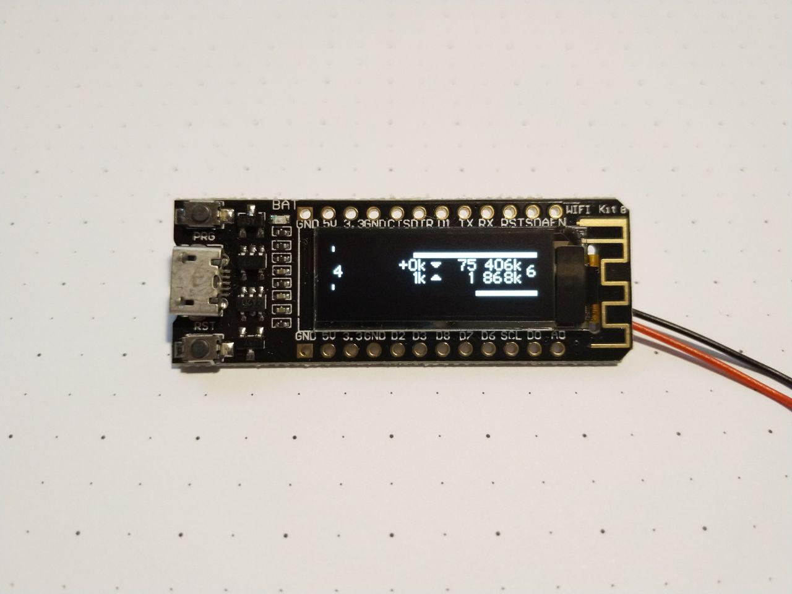

ESP8266 Network Throughput Meter
================================

Queries the current network throughput from an "info host" via a raw TCP
protocol and displays it on a 128x32px display.

Developed and tested for a "WiFi Kit 8"-style ESP8266 + OLED integrated board.

Setup
-----

1. Add iptables rules for counting bytes (the netnettp script counts bytes for
   the first rule in `COUNTING_DOWNSTREAM` and `COUNTING_UPSTREAM`):
      iptables -N COUNTING_DOWNSTREAM
      iptables -N COUNTING_UPSTREAM
      iptables -I INPUT -i internet0 -j COUNTING_DOWNSTREAM
      iptables -I FORWARD -i internet0 -j COUNTING_DOWNSTREAM
      iptables -I OUTPUT -o internet0 -j COUNTING_UPSTREAM
      iptables -I FORWARD -o internet0 -j COUNTING_UPSTREAM
      iptables -I COUNTING_DOWNSTREAM -j RETURN
      iptables -I COUNTING_UPSTREAM -j RETURN
      ip6tables -N COUNTING_DOWNSTREAM
      ip6tables -N COUNTING_UPSTREAM
      ip6tables -I INPUT -i internet0 -j COUNTING_DOWNSTREAM
      ip6tables -I FORWARD -i internet0 -j COUNTING_DOWNSTREAM
      ip6tables -I OUTPUT -o internet0 -j COUNTING_UPSTREAM
      ip6tables -I FORWARD -o internet0 -j COUNTING_UPSTREAM
      ip6tables -I COUNTING_DOWNSTREAM -j RETURN
      ip6tables -I COUNTING_UPSTREAM -j RETURN
2. Copy `.service` files to `/etc/systemd/system`
3. Adjust maximum bandwidth in `/etc/systemd/system/netnetmaxtp.service`
4. Enable and start `netnettp.service`
5. Optionally enable and start `netnetmaxtp.service`
6. Copy `config.example.h` to `config.h` and modify for your setup.
7. Program a WiFi Kit 8 or compatible board with `ThroughputMeter.ino`

Notes
-----

- Byte counters are stored as 64-bit unsigned integers. The Arduino environment
  does not provide native conversion functions for this, even on the ESP8266,
  so conversion is done manually.
  Non-digit characters are silently ignored.
- Throughput (bytes/sec) is internally stored as 32-bit unsigned integers, so
  it tops out at 4294967295 B/s, i.e. 34.4 Gbit/s. This is currently deemed
  sufficient.
- To align everything symmetrically, the top 1px row is not used.
- The internet connectivity check uses Cloudflare's Public DNS website by
  default, using 1.0.0.1 for IPv4 as it is less commonly mis-configured in
  local networks than 1.1.1.1.
  Using an anycasted target gives the best chance that it will be online; using
  a HTTP-enabled one allows us to resort to TCP requests rather than
  implementing ICMP on the ESP8266.

On-wire "protocol"
------------------

The ESP8266 connects to two different (configurable) ports on the info host.  
It will not send any data to the info host.  
It expects the following data formats, and will close the connection after it has received them:

### Maximum throughput (default port: 17460)

    IPv4 maximum downstream (bytes/sec)
    IPv4 maximum upstream (bytes/sec)
    IPv6 maximum downstream (bytes/sec)
    IPv6 maximum upstream (bytes/sec)

Example (1000 Mbit/s down, 50 Mbit/s up):

    $ nc infohost 17460 < /dev/null
    125000000
    6250000
    125000000
    6250000

### Current byte counters (default port: 17461)

    IPv4 downstream byte count
    IPv4 upstream byte count
    IPv6 downstream byte count
    IPv6 upstream byte count

All counters must be monotonously increasing (i.e. never reset).
Example:

    $ nc infohost 17461 < /dev/null
    52752909410
    7668139684
    227098523468
    17179238881
